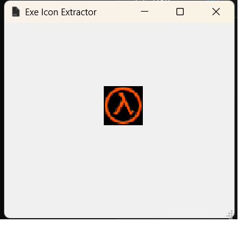

# Exe Icon Extractor

Exe Icon Extractor is a simple graphical user interface (GUI) application built with PyQt5 that allows users to extract and display the icon from an `.exe` file by dragging and dropping the file onto the application window.



## Features

- Drag and drop an `.exe` file to extract and display its icon.
- No need to save extra files like `icon.bmp` or `icon_converter.png`.
- User-friendly interface with clear instructions.

## Prerequisites

Make sure you have the following installed:

- Python 3.x
- PyQt5
- Pillow
- pywin32

You can install the required Python packages using pip:

```bash
pip install PyQt5 Pillow pywin32
